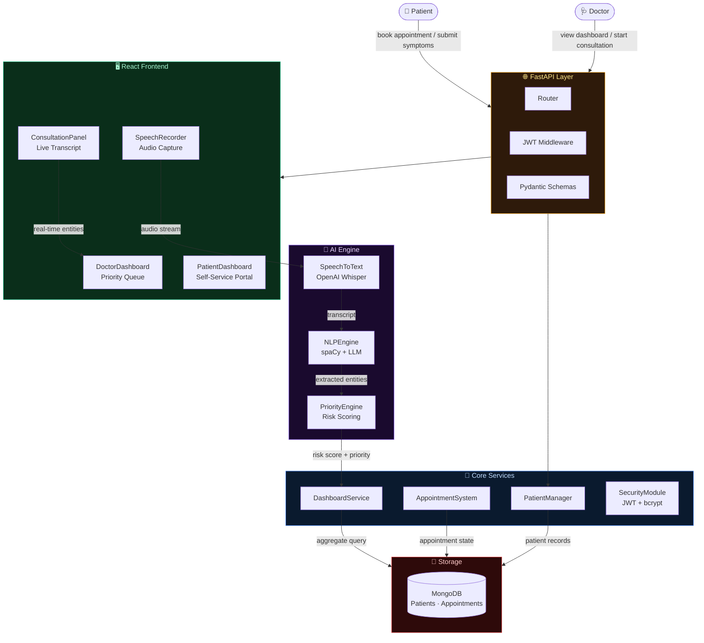
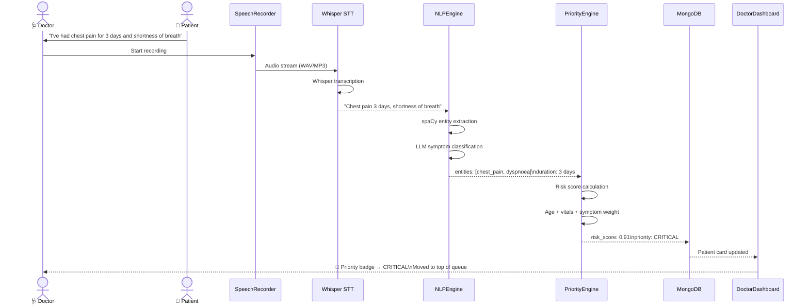
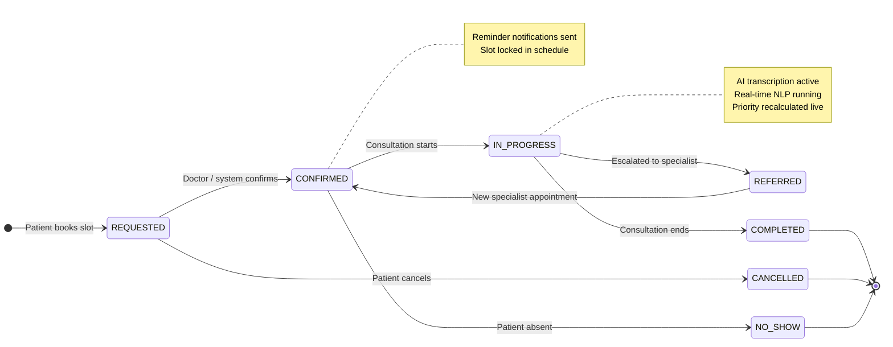
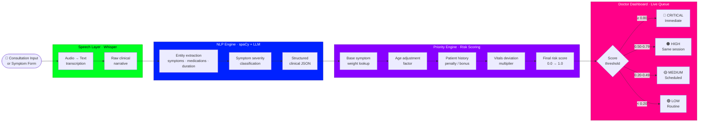
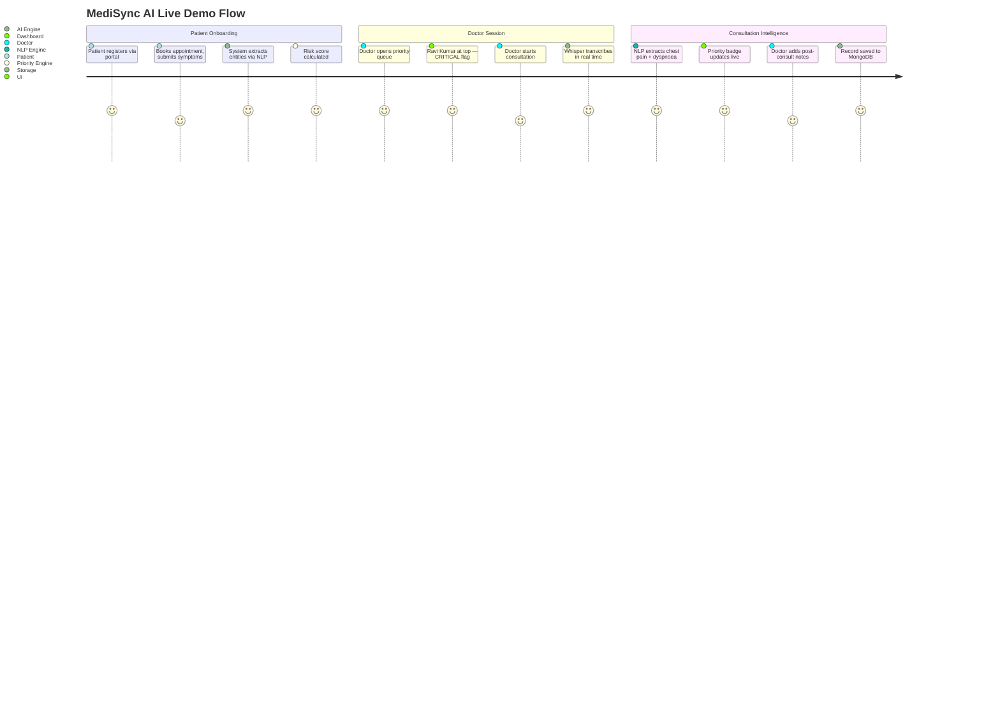

<div align="center">

```
███╗   ███╗███████╗██████╗ ██╗    ███████╗██╗   ██╗███╗   ██╗ ██████╗
████╗ ████║██╔════╝██╔══██╗██║    ██╔════╝╚██╗ ██╔╝████╗  ██║██╔════╝
██╔████╔██║█████╗  ██║  ██║██║    ███████╗ ╚████╔╝ ██╔██╗ ██║██║
██║╚██╔╝██║██╔══╝  ██║  ██║██║    ╚════██║  ╚██╔╝  ██║╚██╗██║██║
██║ ╚═╝ ██║███████╗██████╔╝██║    ███████║   ██║   ██║ ╚████║╚██████╗
╚═╝     ╚═╝╚══════╝╚═════╝ ╚═╝    ╚══════╝   ╚═╝   ╚═╝  ╚═══╝ ╚═════╝
                                                              ██████╗ ██╗
                                                              ██╔══██╗██║
                                                              ███████║██║
                                                              ██╔══██║██║
                                                              ██║  ██║██║
                                                              ╚═╝  ╚═╝╚═╝
```

### *AI-Powered Clinical Intelligence Platform for Modern Healthcare*

<br/>

[](tests/)
[](https://python.org)
[](https://fastapi.tiangolo.com)
[](https://react.dev)
[](https://mongodb.com)
[](https://spacy.io)
[](LICENSE)

<br/>

> **"Doctors spend 49% of their time on paperwork — not patients.**
> **MediSync AI gives that time back."**

<br/>

[**⚡ Quick Start**](#-quick-start) · [**🏗 Architecture**](#-architecture) · [**🧠 AI Engine**](#-ai-engine--original-contribution) · [**⚖️ Priority System**](#️-priority-engine--original-contribution) · [**🎬 Demo**](#-the-demo-scenario) · [**👥 Team**](#-team)

</div>

---

## 🔥 The Problem — What's Actually Broken

<table>
<tr>
<td width="50%">

**What clinics experience today:**
```
Patient arrives  →  Receptionist manually logs details
Doctor consults  →  Types notes during the session
Visit ends       →  Records scattered across systems
Next visit       →  Doctor scrambles to recall history
Emergency        →  Critical info nowhere to be found
```

</td>
<td width="50%">

**What's missing:**
- ❌ No real-time transcription of consultations
- ❌ No AI-powered risk stratification
- ❌ Manual appointment booking — error-prone
- ❌ No intelligent patient prioritization
- ❌ Zero context carried between visits

</td>
</tr>
</table>

Healthcare isn't just a scheduling problem. It's a **data problem** — unstructured, siloed, and slow. MediSync AI solves it with an end-to-end intelligent clinical platform.

---

## 🏗 Architecture

### The Full System at a Glance



---

### The Consultation Write Path — From Voice to Insight



---

### The Appointment State Machine



---

### The Patient Priority Queue — How Rankings Are Decided



---

## 🧠 AI Engine — *Original Contribution*

> **Converts unstructured doctor-patient speech into structured, actionable clinical data in real time.**

### Speech-to-Text — Whisper Integration

```python
# ai_engine/speech_to_text.py
async def transcribe(self, audio_file: BinaryIO) -> TranscriptionResult:
    """
    Accepts raw audio (WAV, MP3, M4A) from SpeechRecorder.jsx
    Returns timestamped transcript with speaker diarization.
    
    Model: openai/whisper-large-v3
    Latency target: < 2s for 30s audio clip
    """
    result = await self.whisper_client.transcribe(
        audio=audio_file,
        language="en",
        response_format="verbose_json",   # timestamps + segments
        temperature=0.0                   # deterministic clinical output
    )
    return TranscriptionResult(
        text=result.text,
        segments=result.segments,         # For ConsultationPanel live display
        duration=result.duration
    )
```

### NLP Engine — Entity Extraction

```python
# ai_engine/nlp_engine.py
async def extract_entities(self, text: str) -> ClinicalEntities:
    """
    Two-stage extraction:
    Stage 1 → spaCy: symptoms, medications, body parts, durations
    Stage 2 → LLM:  severity inference, negation handling, context
    
    Input:  "No chest pain but severe headache for two days"
    Output: ClinicalEntities(
                symptoms=["headache"],        # chest_pain negated ✓
                severity={"headache": 0.65},
                duration={"headache": "2d"},
                negated=["chest_pain"]
            )
    """
    spacy_doc = self.nlp_model(text)
    raw_entities = self._extract_spacy(spacy_doc)
    refined = await self._llm_refine(raw_entities, text)   # handles negation
    return refined
```

---

## ⚖️ Priority Engine — *Original Contribution*

> *"Not all patients are equal. The sickest person in the waiting room should never wait longest."*

### The Scoring Formula

```python
# ai_engine/priority_engine.py

SYMPTOM_WEIGHTS = {
    "chest_pain":          0.90,   # Potential cardiac event
    "dyspnoea":            0.85,   # Respiratory compromise
    "altered_consciousness": 0.95, # Neurological emergency
    "fever_high":          0.60,
    "headache":            0.40,
    "fatigue":             0.20,
    # ... 40+ clinical entities mapped
}

def calculate_risk_score(self, patient: Patient, entities: ClinicalEntities) -> float:
    # Base: weighted max of extracted symptoms
    base = max(SYMPTOM_WEIGHTS.get(s, 0.1) for s in entities.symptoms)

    # Age adjustment (paediatric + elderly get uplift)
    age_factor = 1.15 if patient.age < 5 or patient.age > 70 else 1.0

    # History modifier (chronic conditions compound risk)
    history_factor = 1.10 if patient.has_chronic_condition else 1.0

    # Duration penalty (longer = potentially more serious)
    duration_factor = 1.05 if entities.max_duration_days > 3 else 1.0

    score = min(base * age_factor * history_factor * duration_factor, 1.0)
    return round(score, 4)
```

### Live Priority Card

```
┌─────────────────────────────────────────────────────────────┐
│  🔴 CRITICAL                          Risk: ████████████ 0.91│
├────────────────────────────┬────────────────────────────────┤
│  PATIENT                   │  EXTRACTED ENTITIES            │
│  Ravi Kumar, 67M           │  ✦ chest_pain (3 days)         │
│  Appt: 10:30 AM            │  ✦ dyspnoea                    │
│  Dr. Sharma                │  ✦ diaphoresis                 │
├────────────────────────────┴────────────────────────────────┤
│  History: Hypertension · Diabetes Type 2                    │
│  Age factor: 1.15 · Chronic factor: 1.10                   │
├─────────────────────────────────────────────────────────────┤
│  Recommendation: See immediately — cardiac workup advised   │
│  [ 👁 View Full Record ]  [ ▶ Start Consultation ]         │
└─────────────────────────────────────────────────────────────┘
```

**Critical design invariant:**
```
PriorityEngine NEVER writes to DB.
PriorityEngine ONLY returns scores.
DashboardService owns the queue.
AppointmentSystem owns the state.
```

---

## 🧱 The Domain Model — Everything Is Typed

```python
@dataclass
class Patient:
    id: str                        # UUID4 — auto-generated
    name: str
    age: int
    gender: Gender                 # MALE | FEMALE | OTHER
    contact: ContactInfo           # phone, email, address
    medical_history: list[str]     # ICD-10 coded conditions
    current_medications: list[str]
    created_at: datetime
    updated_at: datetime

@dataclass
class Appointment:
    id: str
    patient_id: str
    doctor_id: str
    scheduled_at: datetime
    status: AppointmentStatus      # State machine (see diagram above)
    symptoms_raw: str              # Free-text from patient
    entities: ClinicalEntities     # Post-NLP structured form
    risk_score: float              # 0.0 – 1.0
    priority: PriorityLevel        # CRITICAL | HIGH | MEDIUM | LOW
    transcript: Optional[str]      # Whisper output
    notes: Optional[str]           # Doctor's post-consult notes
```

Three roles. Three dashboards. Zero confusion:

| Role | Dashboard | Key Actions |
|---|---|---|
| `PATIENT` | Self-service portal | Book appointments · Submit symptoms · View history |
| `DOCTOR` | Priority queue + consultation workspace | See ranked patients · Run AI consultation · Add notes |
| `ADMIN` | System overview | Manage doctors · View analytics · Configure slots |

---

## 📡 The API Layer — Clean, Versioned, Documented

Every resource follows REST conventions. JWT-protected via Bearer tokens.

```
GET     /api/v1/patients/                  → List patients (paginated)
POST    /api/v1/patients/                  → Register new patient
GET     /api/v1/patients/{id}              → Patient record + history
PUT     /api/v1/patients/{id}              → Update record

POST    /api/v1/appointments/              → Book appointment
GET     /api/v1/appointments/{id}          → Appointment detail
PATCH   /api/v1/appointments/{id}/status  → State transition

POST    /api/v1/consultation/transcribe    → Audio → transcript + entities
POST    /api/v1/consultation/analyse       → Entities → risk score

GET     /api/v1/dashboard/                 → Doctor's priority queue
GET     /api/v1/dashboard/stats            → Aggregate metrics

POST    /api/v1/auth/login                 → JWT token
POST    /api/v1/auth/refresh               → Refresh token
```

**What this means:**
- Frontend never calls AI models directly
- All business logic lives in services, not routers
- Every endpoint has a Pydantic schema — no raw dicts
- OpenAPI docs auto-generated at `/api/docs`

---

## 🌿 Appointment System — The State Machine in Code

Appointments aren't just records — they're state machines with strict valid transitions:

```python
VALID_TRANSITIONS = {
    AppointmentStatus.REQUESTED:    {CONFIRMED, CANCELLED},
    AppointmentStatus.CONFIRMED:    {IN_PROGRESS, NO_SHOW, CANCELLED},
    AppointmentStatus.IN_PROGRESS:  {COMPLETED, REFERRED},
    AppointmentStatus.REFERRED:     {CONFIRMED},   # New specialist appt
}

async def transition(self, appt_id: str, new_status: AppointmentStatus) -> Appointment:
    appt = await self.repo.get(appt_id)
    if new_status not in VALID_TRANSITIONS[appt.status]:
        raise InvalidTransitionError(appt.status, new_status)
    appt.status = new_status
    appt.updated_at = utcnow()
    return await self.repo.update(appt)
```

The **Predict-before-book** check prevents double-booking:

```
Doctor's schedule: [10:00, 10:30, 11:00 — FULL]
Patient requests:   10:30 slot

System: "Slot unavailable — next available: 11:30 AM"
→ Suggests alternatives automatically ✓
```

---

## 🔬 Doctor Dashboard — 4 Panels, 1 Source of Truth

```
┌──────────────────────────────────────────────────────────────────┐
│  🩺 Dr. Sharma — Morning Session                    May 2, 2026 │
├──────────────────┬──────────────────┬──────────────────┬─────────┤
│  TODAY'S STATS   │  PRIORITY QUEUE  │  CONSULTATION    │  GRAPH  │
│                  │                  │  WORKSPACE       │  PANEL  │
│  ✦ 12 patients   │  🔴 Ravi K. 0.91 │                  │         │
│  ✦  3 critical   │  🔴 Priya M. 0.87│  🎤 Recording... │  Vitals │
│  ✦  2 referred   │  🟠 Arjun S. 0.72│                  │  trends │
│  ✦  7 completed  │  🟡 Meera D. 0.41│  [Transcript     │  over   │
│                  │  🟢 Vikram P.0.18│   appears live]  │  time   │
│  Avg wait: 8min  │                  │                  │         │
└──────────────────┴──────────────────┴──────────────────┴─────────┘
```

---

## 🎬 The Demo Scenario



**Step by step, what the judges will see:**

```
Step 1  →  Patient "Ravi Kumar, 67M" books a 10:30 AM slot
           Submits: "chest pain for 3 days and difficulty breathing"
           NLP: chest_pain (0.90) · dyspnoea (0.85) · age_factor: 1.15
           Priority: 🔴 CRITICAL — Score: 0.91

Step 2  →  Doctor opens dashboard
           Ravi Kumar is #1 in the queue, flagged CRITICAL
           Card shows extracted entities + history: Hypertension, Diabetes

Step 3  →  Doctor clicks "Start Consultation"
           SpeechRecorder activates → Whisper begins transcription
           ConsultationPanel shows live rolling transcript

Step 4  →  Doctor speaks, patient responds
           NLP picks up "no fever, but sweating heavily"
           Entities update live: diaphoresis added, fever removed
           Score recalculated mid-session

Step 5  →  Consultation ends
           Doctor adds notes, marks appointment COMPLETED
           Patient history updated automatically
           Next session: full context pre-loaded
```

---

## ⚡ Quick Start

```bash
# 1. Clone and setup
git clone https://github.com/avinashsinghpal/Medi_Sync.git && cd Medi_Sync
cp .env.example .env
# → Add OPENAI_API_KEY, MONGODB_URI, JWT_SECRET to .env

# 2. Backend
poetry install
make migrate        # MongoDB collection setup + indexes
make seed           # Demo patients, doctors, appointments

# 3. Run backend
make dev            # API → http://localhost:8000
                    # Docs → http://localhost:8000/api/docs

# 4. Frontend
cd frontend
npm install
npm run dev         # Dashboard → http://localhost:5173
```

**Verify the system:**
```bash
make test-unit
# ≥ 90% coverage, all modules isolated

make verify
# Smoke test: auth → book → consult → dashboard

curl localhost:8000/health
# {"status": "ok", "patients": 8, "appointments": 12, "ai_engine": "ready"}
```

---

## 🧪 Test Suite

```
━━━━━━━━━━━━━━━━━━━━━━━━━━━━━━━━━━━━━━━━━━━━━━━━━━━
  Target: ≥ 90% coverage · 0 failures · 0 warnings
━━━━━━━━━━━━━━━━━━━━━━━━━━━━━━━━━━━━━━━━━━━━━━━━━━━

  tests/unit/test_types.py              ✓  All domain type validation
  tests/unit/test_security.py           ✓  JWT + bcrypt auth tests
  tests/unit/test_speech.py             ✓  Whisper mock transcription
  tests/unit/test_nlp.py                ✓  Entity extraction cases
  tests/unit/test_priority.py           ✓  Risk score classification
  tests/unit/test_patient.py            ✓  Patient CRUD operations
  tests/unit/test_appointment.py        ✓  State machine transitions
  tests/unit/test_dashboard.py          ✓  Aggregation service logic
  tests/integration/test_api.py         ✓  Full API endpoint suite
  tests/integration/test_e2e.py         ✓  End-to-end consultation flow
━━━━━━━━━━━━━━━━━━━━━━━━━━━━━━━━━━━━━━━━━━━━━━━━━━━
```

Every module is testable in isolation — no real DB, no real Whisper API, no real LLM required in unit tests. 100% mock-driven via `conftest.py` fixtures with typed interfaces.

---

## 🗂 Repository Structure

```
medisync/
│
├── medisync/                  # Main Python package
│   ├── core/                  # ★ Zero dependencies — pure domain
│   │   ├── types.py           # Patient, Appointment, ClinicalEntities, enums
│   │   ├── config.py          # Pydantic Settings (all env vars)
│   │   ├── errors.py          # Domain exceptions → HTTP status codes
│   │   └── security.py        # JWT generation + bcrypt password hashing
│   │
│   ├── storage/               # Raw DB drivers. Zero business logic.
│   │   ├── patient_repository.py     # MongoDB CRUD for patients
│   │   └── appointment_repository.py # MongoDB CRUD for appointments
│   │
│   ├── patient/               # Patient domain service
│   │   └── patient_management.py    # All CRUD + search operations
│   │
│   ├── appointment/           # Appointment domain service
│   │   └── appointment_system.py    # Booking + state machine transitions
│   │
│   ├── ai_engine/             # 🧠 Intelligence pipeline
│   │   ├── speech_to_text.py  # Whisper audio → text transcription
│   │   ├── nlp_engine.py      # spaCy + LLM entity extraction
│   │   └── priority_engine.py # Risk scoring + priority classification
│   │
│   ├── dashboard/             # Aggregation + live queue service
│   │   └── dashboard.py       # Doctor dashboard data assembly
│   │
│   └── api/                   # FastAPI — thin HTTP wrapper only
│       ├── app.py             # Lifespan wiring of all components
│       ├── dependencies.py    # JWT auth + DB injection
│       ├── schemas/           # Pydantic request/response models
│       └── routers/
│           ├── patients.py    # Patient CRUD endpoints
│           ├── appointments.py# Appointment lifecycle endpoints
│           ├── consultation.py# AI consultation processing
│           ├── dashboard.py   # Doctor dashboard endpoints
│           └── auth.py        # Login + token refresh
│
├── frontend/                  # React 18 + Tailwind dashboard
│   └── src/
│       ├── components/
│       │   ├── shared/        # PriorityBadge · Navbar · LoadingSpinner
│       │   ├── PatientSummaryCard.jsx   # Patient card with risk flags
│       │   ├── PriorityQueue.jsx        # Live sorted appointment queue
│       │   ├── DashboardStats.jsx       # Session statistics cards
│       │   ├── SpeechRecorder.jsx       # Browser audio capture
│       │   └── ConsultationPanel.jsx    # Live transcript workspace
│       ├── pages/
│       │   ├── DoctorDashboard.jsx      # Main doctor view
│       │   ├── PatientDashboard.jsx     # Patient self-service portal
│       │   ├── BookingForm.jsx          # Appointment booking flow
│       │   └── LoginPage.jsx            # Auth flow UI
│       ├── hooks/             # usePatientData · useDashboard · useConsultation
│       └── store/             # Zustand: auth · ui · consultation state
│
├── scripts/
│   ├── seed_demo_data.py      # 8 demo patients + realistic appointments
│   └── verify_system.py       # Smoke test: auth → book → consult → dashboard
│
└── tests/                     # Unit + integration + e2e
    ├── conftest.py            # Typed mock fixtures (no real DB/LLM/Whisper)
    ├── unit/                  # Per-module isolated tests
    └── integration/           # Live MongoDB + full scenario tests
```

---

## 📊 Research & Inspiration Attribution

| Concept | Source | Our Implementation |
|---|---|---|
| Large-scale speech transcription | [OpenAI Whisper](https://arxiv.org/abs/2212.04356) (Radford et al., 2022) | `ai_engine/speech_to_text.py` |
| Clinical NLP entity extraction | [spaCy](https://spacy.io) + [scispaCy](https://allenai.github.io/scispacy/) | `ai_engine/nlp_engine.py` |
| Patient risk stratification | Standard triage protocols (MEWS, NEWS2) | `ai_engine/priority_engine.py` |
| Async API design | [FastAPI](https://fastapi.tiangolo.com) best practices | `api/` — entire layer |
| **AI Priority Queue** 🧠 | **Original** | `priority_engine.py` · `dashboard.py` |
| **Live Consultation Workspace** 🎤 | **Original** | `SpeechRecorder.jsx` · `ConsultationPanel.jsx` |

---

## 🆚 MediSync AI vs The Field

| Capability | Manual Clinic | Basic EMR | Generic Booking App | **MediSync AI** |
|---|---|---|---|---|
| Real-time consultation transcription | ❌ | ❌ | ❌ | ✅ **Original** |
| AI-powered risk stratification | ❌ | ❌ | ❌ | ✅ **Original** |
| Intelligent patient prioritization | ❌ | Partial | ❌ | ✅ |
| NLP entity extraction from speech | ❌ | ❌ | ❌ | ✅ |
| Appointment state machine | ❌ | ✅ | ✅ | ✅ |
| Role-based dashboards (doctor / patient) | ❌ | Partial | ❌ | ✅ |
| JWT-secured multi-user auth | ❌ | ✅ | ✅ | ✅ |
| Full test coverage (unit + e2e) | ❌ | ❌ | ❌ | ✅ |
| Fully async, event-driven backend | ❌ | ❌ | ❌ | ✅ |

---

## 🛠 Tech Stack

<table>
<tr><td><b>Backend</b></td><td>Python 3.11 · FastAPI (async) · Pydantic v2 · Motor (async MongoDB)</td></tr>
<tr><td><b>AI / NLP</b></td><td>OpenAI Whisper · spaCy · scispaCy · LLM-powered entity refinement</td></tr>
<tr><td><b>Auth</b></td><td>JWT (python-jose) · bcrypt password hashing · Role-based middleware</td></tr>
<tr><td><b>Database</b></td><td>MongoDB · Async Motor driver · Indexed collections for fast patient lookup</td></tr>
<tr><td><b>Frontend</b></td><td>React 18 · Vite · Tailwind CSS · Zustand · React Query · React Router v6</td></tr>
<tr><td><b>Testing</b></td><td>pytest · pytest-asyncio strict mode · ≥ 90% coverage · Mock-driven unit isolation</td></tr>
</table>

---

## 👥 Team

<table>
<tr>
<td align="center" width="25%">
<b>Dev A</b><br/>
<i>Backend Foundation & AI Engine</i><br/><br/>
<code>core/</code> <code>ai_engine/</code> <code>dashboard/</code><br/><br/>
Domain types · JWT security · Whisper STT · NLP entity extraction · Priority Engine · Dashboard service · Performance tuning
</td>
<td align="center" width="25%">
<b>Dev B</b><br/>
<i>Patient & Appointment Systems</i><br/><br/>
<code>storage/</code> <code>patient/</code> <code>appointment/</code><br/><br/>
MongoDB schemas · Patient CRUD · Appointment state machine · E2E test suite · Demo seed data · System smoke tests
</td>
<td align="center" width="25%">
<b>Dev C</b><br/>
<i>API Layer & Integration</i><br/><br/>
<code>api/</code> <code>tests/integration/</code><br/><br/>
FastAPI wiring · Pydantic schemas · JWT middleware · REST routers · Consultation + Dashboard endpoints · OpenAPI docs
</td>
<td align="center" width="25%">
<b>Dev D</b><br/>
<i>Frontend & Dashboard</i><br/><br/>
<code>frontend/</code><br/><br/>
React architecture · Auth store · Priority queue UI · Doctor dashboard · SpeechRecorder · ConsultationPanel · Patient booking flow
</td>
</tr>
</table>

---

<div align="center">

**Built at the MediSync AI Hackathon · April 2026**

<br/>

*Not just booking appointments.*
*Understanding patients.*
*AI that helps doctors focus on what matters.*

<br/>

---

```
"The good physician treats the disease; the great physician
 treats the patient who has the disease."
                                    — William Osler

MediSync AI helps doctors be great.
```

</div>
